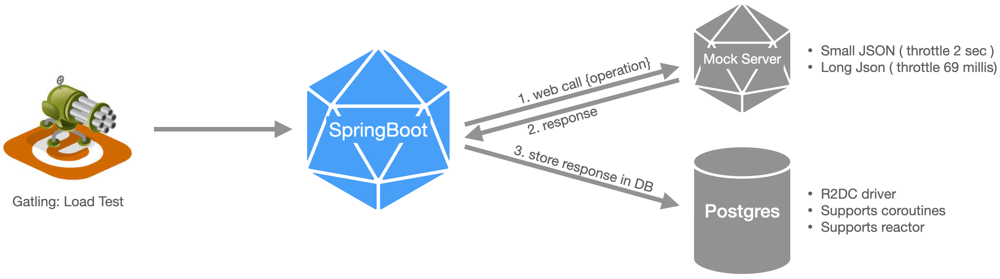

# Kotlin Web Service with couroutines / flux test 

## Getting Started
---------------
There are 4 directories:

* `sample-http-server` : mock web server; simulates http server; works on port 9090 (fast, you can set up throttle)
* `postgres-docker` : postgres in the docker
* `kotlin-flux-sandbox` : app which communicates with _postgres_ & _sample-http-server_
* `gatling-gradle-load` : load tests;works against _kotlin-flux-sandbox_



SpringBoot endpoints:

| Endpoint       | Description           |
|------------- |---------------| 
| `/db/all`| all entries from DB | 
| `/db/clear` | clear all entries in DB | 
| `/fill-with-test/{howMany}`| filles DB with given amount of test entries | 
| `/blocking/{operation}`| executes blocking web call to mock server | 
| `/flux/{operation}`| executes non blocking web call to mock server using _reactor_| 
| `/coroutine/{operation}`| executes non blocking web call to mock server using _couroutines_| 
| `/blocking/{operation}/store`| executes blocking web call to mock server and stores result in DB| 
| `/flux/{operation}/store`| executes non blocking web call to mock server and stores result in DB using reactive driver and _flux_| 
| `/coroutine/{operation}/store`| executes non blocking web call to mock server and stores result in DB using reactive driver and _coroutines_| 

Operations on mock web server:

| Endpoint (operation)       | Description           |
|------------- |---------------| 
| `small-json`| content length 41 bytes, JSON, throttle 2sec | 
| `long-json`| content length 7431 bytes, JSON, throttle 69 millis | 

#### Technicals:
* kotlin : 1.4.31
* java 11.0.10.9.1-amzn

### Run all
#### STEP 1: POSTGRES DB
1. go to `docker` directory
1. start docker: `docker-compose up -d`
1. start bash: `docker-compose run database bash`
1. Login to psql (pass: _magical_password_): `psql --host=database --username=unicorn_user --dbname=rainbow_database`
1. Create table _texts_: `CREATE TABLE texts(id serial PRIMARY KEY, some_text VARCHAR(500) NOT NULL)`

#### STEP 2: SAMPLE WEB SERVER
1. go to `sample-http-server` directory
1. start server: `gradle run`

#### STEP 3: KOTLIN WEB APP
1. go to `kotlin-flux-sandbox` directory
1. start server: `./gradlew bootRun`
1. test if all works:  `curl -v "localhost:8080/db/all"`

#### STEP 4: Stress test it!
1. go to `gatling-gradle-plugin-demo` directory
1. start server: `./gradlew clean gatlingRun`


#### (optinal) Delete postgres data 
1. go to `docker` directory
1. execute `docker-compose down --volumes`

#### Some postgres useful commands
```
\dt+ # list all tables with details
\d table name # table details

```
